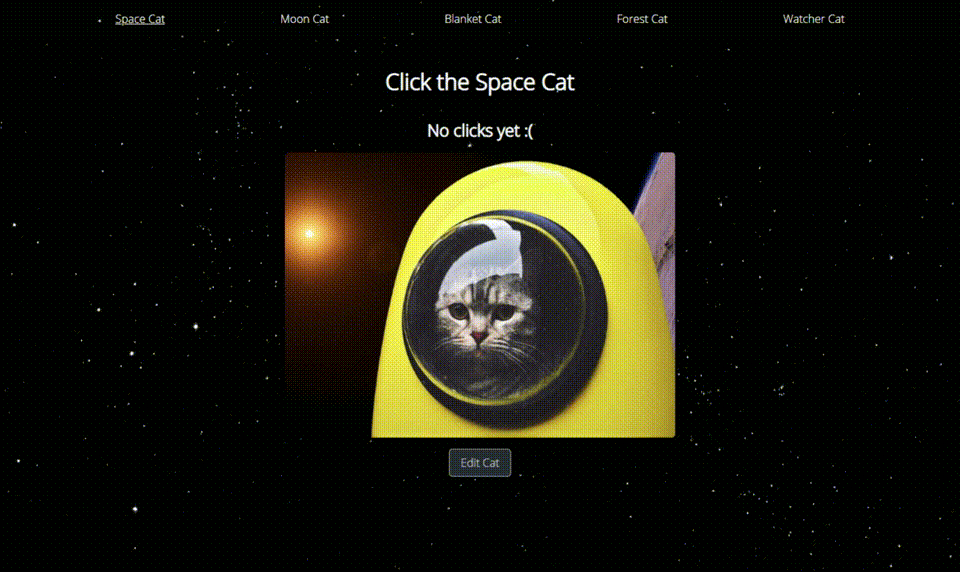

# Cat Clicker

Click the cats to make them meow in joy. Supports multiple cats and editing existing cats. Built to satisfy specs required by Udacity's excellent [Javascript Design Patterns](https://www.udacity.com/course/javascript-design-patterns--ud989) course.

  

